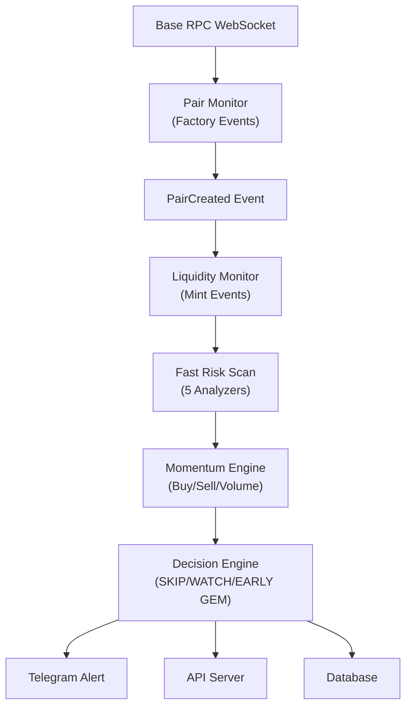
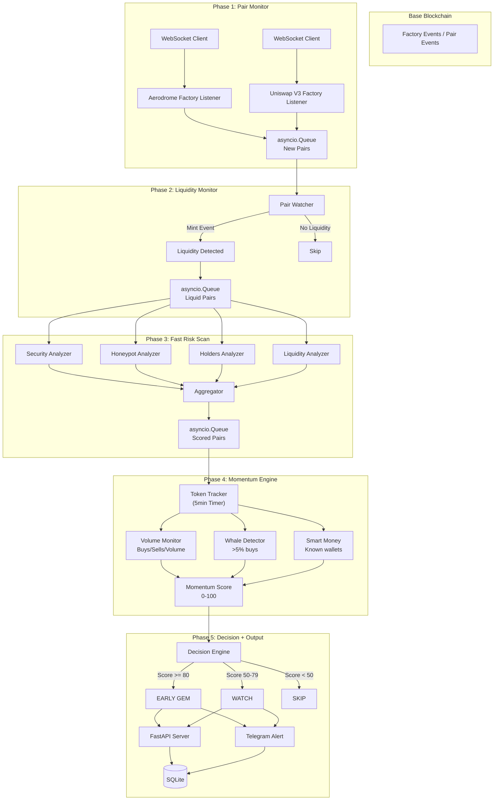

# 🚀 Base Launch Detector - الخطة المعمارية الكاملة

## الوضع الحالي للمشروع

المشروع الحالي (`main.py`) يعمل بنظام **المسح اليومي (Daily Batch Scan)**:
- يجلب الرموز الجديدة من DexScreener API كل 24 ساعة
- يشغل 5 محللات (Security, Honeypot, Holders, Liquidity, GitHub)
- يصنف الرموز إلى Positive/Negative
- يرسل النتائج إلى Telegram مع رسوم بيانية
- يخزن كل شيء في SQLite

### المحللات الموجودة (سنحتفظ بها ونربطها):
| المحلل | المهمة | API المستخدم |
|--------|--------|-------------|
| `security_score.py` | درجة الأمان 0-100، كشف proxy/mint/blacklist | GoPlus Security |
| `honeypot_checker.py` | كشف honeypot، ضريبة البيع/الشراء | GoPlus Security |
| `holders_checker.py` | توزيع الحاملين، التركيز | Basescan |
| `liquidity_checker.py` | حالة قفل السيولة | UNCX/Unicrypt |
| `github_checker.py` | تحليل مستودع GitHub | GitHub API |

---

## الهدف: نظام المراقبة المباشر (Real-time Streaming)

بدلاً من المسح اليومي، النظام الجديد يستمع لأحداث البلوكشين **فور حدوثها**:



---

## هندسة النظام الكاملة



---

## هيكل الملفات الجديد

```
base_bot/
├── main.py                          # المنسق اليومي (موجود، لا نلمسه)
├── monitors/                        # ⭐ جديد: نظام المراقبة المباشر
│   ├── __init__.py
│   ├── pair_monitor.py             # المرحلة 1: مراقب الأزواج الجديدة
│   ├── aerodrome_factory.py        # مستمع مصنع Aerodrome
│   ├── uniswap_factory.py          # مستمع مصنع Uniswap V3
│   ├── liquidity_monitor.py        # المرحلة 2: مراقب السيولة
│   └── momentum_engine.py          # المرحلة 4: محرك الزخم
├── decision/                        # ⭐ جديد: نظام القرار
│   ├── __init__.py
│   ├── scoring.py                  # نظام الدرجات 0-100
│   └── classifier.py               # تصنيف SKIP/WATCH/EARLY GEM
├── api/                             # ⭐ جديد: واجهة API
│   ├── __init__.py
│   ├── server.py                   # FastAPI server
│   ├── routes.py                   # REST endpoints
│   └── ws_routes.py               # WebSocket endpoints
├── alerts/                          # ⭐ جديد: نظام التنبيهات الموسع
│   ├── __init__.py
│   ├── alert_manager.py            # مدير التنبيهات
│   └── alert_formatters.py         # تنسيق الرسائل
├── analyzers/                       # ✅ موجود، نربطه فقط
│   ├── __init__.py
│   ├── security_score.py
│   ├── honeypot_checker.py
│   ├── holders_checker.py
│   ├── liquidity_checker.py
│   └── github_checker.py
├── scanner/                         # ✅ موجود
│   ├── __init__.py
│   ├── base_scanner.py
│   └── dex_scanner.py
├── telegram_bot/                    # ✅ موجود، سنوسعه
│   ├── __init__.py
│   └── sender.py
├── charts/                          # ✅ موجود
│   ├── __init__.py
│   └── chart_generator.py
├── database/                        # ✅ موجود، سنوسع المخطط
│   ├── __init__.py
│   └── storage.py
├── config/                          # ⭐ جديد: تكوين مركزي
│   ├── __init__.py
│   ├── settings.py                  # جميع الإعدادات
│   ├── contracts.py                # عناوين العقود و ABI
│   └── known_wallets.py            # محافظ معروفة (Smart Money)
├── .env
├── requirements.txt
└── README.md
```

---

## المواصفات التفصيلية لكل مرحلة

### 🔷 المرحلة 1: Pair Monitor

**الهدف:** اكتشاف أي عملة جديدة فور إنشاء زوجها على أي منصة.

**المنصات المستهدفة (حسب الأولوية):**
| # | المنصة | عقد المصنع | الحدث |
|---|--------|-----------|-------|
| 1 | Aerodrome V2 | `0x420DD381b31aEf6683db6B902084cB0FFEe40Da` | `PoolCreated` |
| 2 | Uniswap V3 | `0x33128a8fC17869897dcE68Ed026d694621f6FDfD` | `PoolCreated` |

**التقنية:**
- `web3.py` مع WebSocket provider (`websockets` library)
- استخدام `eth_subscribe` للاستماع لـ logs مباشرة
- أو `eth_getLogs` مع polling كل بلوك (احتياطي إذا فشل WebSocket)

**المخرجات (توضع في asyncio.Queue):**
```python
@dataclass
class NewPairEvent:
    token_address: str       # 0x...
    pair_address: str        # 0x...
    dex: str                 # "aerodrome" | "uniswap_v3"
    base_token: str          # WETH, USDC, cbBTC, etc.
    created_at: float        # Unix timestamp
    block_number: int
    tx_hash: str
```

**الخصائص المستخرجة فوراً:**
- اسم العملة (من العقد)
- رمز العملة (symbol)
- نوع الزوج (WETH/USDC/cbBTC)
- وقت الإنشاء
- صاحب العقد (owner)
- هل العقد Proxy؟
- هل الـ mint مُفعّل؟

---

### 🔷 المرحلة 2: Liquidity Monitor

**الهدف:** التأكد من أن الزوج قابل للتداول فعلاً (عليه سيولة).

**الأحداث المراقبة:**
- `Mint()` على عقد الزوج ← سيولة أُضيفت
- `Burn()` على عقد الزوج ← سيولة سُحبت

**المخرجات:**
```python
@dataclass
class LiquidityEvent:
    token_address: str
    pair_address: str
    liquidity_usd: float      # قيمة السيولة بالدولار
    base_amount: float
    quote_amount: float
    base_token: str            # WETH, USDC
    event_type: str            # "added" | "removed" | "increased"
    block_number: int
    timestamp: float
```

**تصنيف السيولة:**
- `MICRO`: < $1,000
- `LOW`: $1,000 - $5,000
- `MEDIUM`: $5,000 - $20,000
- `HIGH`: $20,000 - $100,000
- `WHALE`: > $100,000

**تنبيهات السيولة الحرجة:**
- 🚨 سحب سيولة كبير (>50%)
- ✅ زيادة سيولة كبيرة (>2x)
- ⚠️ سيولة منخفضة (<$500)

---

### 🔷 المرحلة 3: Fast Risk Scan

**الهدف:** استخدام المحللات الموجودة حالياً لاكتشاف المخاطر.

**المحللات المستخدمة (بدون تغيير):**
1. `SecurityScoreChecker` ← درجة 0-100، flags
2. `HoneypotChecker` ← can_buy, can_sell, tax
3. `HoldersChecker` ← توزيع الحاملين
4. `LiquidityChecker` ← قفل السيولة

**لا نستخدم** `GitHubChecker` في المسار السريع (ليس ضرورياً للسرعة).

**يتم تشغيل المحللات الأربعة concurrently عبر `asyncio.gather`.**

**المخرجات:**
```python
@dataclass  
class RiskScanResult:
    token_address: str
    security_score: int         # 0-100
    is_honeypot: bool
    buy_tax: float
    sell_tax: float
    holders_concentration: str  # low/medium/high/extreme
    liquidity_locked: bool
    locked_percentage: float
    proxy_detected: bool
    mintable: bool
    blacklisted: bool
    owner_renounced: bool
    risk_flags: list[str]
    overall_risk_score: int     # 0-100 (combined)
```

---

### 🔷 المرحلة 4: Momentum Engine

**الهدف:** بعد 5 دقائق من الإطلاق، تحليل الزخم الحقيقي.

**المقاييس المحسوبة:**

| المقياس | الفترة | الوصف |
|---------|--------|-------|
| `buy_count` | 5min / 15min / 1hr | عدد عمليات الشراء |
| `sell_count` | 5min / 15min / 1hr | عدد عمليات البيع |
| `volume_usd` | 5min / 15min / 1hr | حجم التداول بالدولار |
| `unique_buyers` | 5min / 15min | عدد المشترين الفريدين |
| `buy_sell_ratio` | 5min | نسبة الشراء/البيع |
| `liquidity_change` | منذ الإطلاق | تغير السيولة % |
| `age_seconds` | - | عمر العملة بالثواني |

**كشف إضافي:**
- 🐋 **Whale Detection:** محفظة اشترت >5% من العرض
- 🧠 **Smart Money:** محافظ معروفة (قاعدة بيانات)
- 🎯 **Sniper Detection:** شراء في أول 3 بلوكات
- 🤖 **Bot Buyers:** نمط شراء آلي
- 📤 **Whale Exit:** حيتان تبيع

**المخرجات:**
```python
@dataclass
class MomentumResult:
    token_address: str
    age_seconds: int
    buy_count_5m: int
    sell_count_5m: int
    volume_5m_usd: float
    volume_15m_usd: float
    unique_buyers: int
    buy_sell_ratio: float
    liquidity_usd: float
    liquidity_change_pct: float
    whales_detected: int
    smart_money_detected: bool
    snipers_detected: int
    momentum_score: int          # 0-100
```

---

### 🔷 المرحلة 5: Decision Engine

**الهدف:** قرار نهائي بدلاً من Positive/Negative.

```python
class Decision(Enum):
    SKIP = "skip"           # ❌ تجاهل
    WATCH = "watch"         # 👀 راقب
    EARLY_GEM = "early_gem" # 💎 جوهرة مبكرة
```

**معادلة القرار (Decision Matrix):**

| المعيار | SKIP | WATCH | EARLY GEM |
|---------|------|-------|-----------|
| Security Score | <40 | 40-70 | >70 |
| Honeypot | YES | No but high tax | NO |
| Liquidity | <$1k | $1k-$10k | >$10k |
| Buy/Sell Ratio | <0.5 | 0.5-1.5 | >1.5 |
| Volume 5min | <$500 | $500-$5k | >$5k |
| Age | <30s | 30s-5min | >5min |
| Whale % | >50% | 20-50% | <20% |
| Momentum Score | <30 | 30-60 | >60 |

---

### 🔷 المرحلة 6: Momentum Score (0-100)

**المعادلة:**

```
Momentum Score = 
    Security_Score        × 0.25   (الأمان)
  + Liquidity_Score       × 0.20   (السيولة)
  + Volume_Score          × 0.20   (الحجم)
  + Buy_Sell_Ratio_Score  × 0.15   (نسبة الشراء/البيع)
  + Holders_Score         × 0.10   (توزيع الحاملين)
  + Age_Score             × 0.10   (العمر)
```

**حساب كل مكون:**
- `Security_Score`: مباشر من GoPlus (0-100)
- `Liquidity_Score`: `min(liquidity_usd / 50000 * 100, 100)`
- `Volume_Score`: `min(volume_5m_usd / 10000 * 100, 100)`
- `Buy_Sell_Ratio_Score`: `min(buy_sell_ratio / 3 * 100, 100)`
- `Holders_Score`: `low=100, medium=60, high=30, extreme=0`
- `Age_Score`: `min(age_seconds / 300 * 100, 100)` (5min = full)

---

### 🔷 المرحلة 7: Telegram Alerts

**أنواع التنبيهات:**

1. 🚀 **New Pair Detected**
```
🚀 New Pair on Aerodrome
Token: ABC
Pair: ABC/WETH
Age: 45 sec
DEX: Aerodrome
Contract: 0x...
```

2. 💧 **Liquidity Added**
```
💧 Liquidity Added
Token: ABC
Amount: $18,000
Base: WETH
Pair: 0x...
```

3. 🛡️ **Risk Scan Complete**
```
🛡️ Risk Analysis: ABC
Security: 85/100 ✅
Honeypot: No ✅
Proxy: No ✅
Mint: Disabled ✅
Tax: Buy 0% / Sell 0%
Score: 82/100
```

4. 🔥 **EARLY GEM Detected**
```
💎 EARLY GEM: ABC/WETH
Age: 6 min | Buyers: 42 | Sells: 7
Volume: $31k | Liquidity: $15k
Momentum: 87/100
Smart Money: Yes 🧠
━━━━━━━━━━━━━━━
Contract: 0x...
DexScreener: [link]
```

5. ⚠️ **Whale Alert**
```
🐋 Whale Detected: ABC
Wallet 0x... bought 15%
Wallet 0x... bought 10%
Risk: High concentration
```

6. 🚨 **Liquidity Removed**
```
🚨 LIQUIDITY REMOVED: ABC
Before: $40,000
After: $3,000
Change: -92.5%
⚠️ POSSIBLE RUG PULL
```

7. 📤 **Whale Exit**
```
📤 Whale Exit: ABC
0x... sold 12%
0x... sold 8%
Volume: $25k outflow
```

---

### 🔷 المرحلة 8: API Layer (FastAPI)

**REST Endpoints:**

| Method | Path | الوصف |
|--------|------|-------|
| `GET` | `/api/v1/tokens` | قائمة بأحدث الرموز |
| `GET` | `/api/v1/tokens/{address}` | تفاصيل رمز محدد |
| `GET` | `/api/v1/tokens/{address}/analysis` | تحليل رمز |
| `GET` | `/api/v1/tokens/{address}/momentum` | زخم رمز |
| `GET` | `/api/v1/alerts` | آخر التنبيهات |
| `GET` | `/api/v1/gems` | قائمة EARLY GEMS |
| `GET` | `/api/v1/stats` | إحصائيات عامة |
| `WS` | `/ws/live` | بث مباشر لكل الأحداث |

**WebSocket Stream (بث مباشر):**
```json
{
  "type": "new_pair",
  "data": {
    "token": "0x...",
    "pair": "0x...", 
    "dex": "Aerodrome",
    "timestamp": 1234567890
  }
}
```

```json
{
  "type": "early_gem",
  "data": {
    "token": "ABC",
    "score": 87,
    "momentum": {...},
    "analysis": {...}
  }
}
```

---

### 🔷 المرحلة 9: Advanced Detection

**قاعدة بيانات المحافظ المعروفة (Smart Money):**
- ملف `config/known_wallets.py` يحتوي على:
  - محافظ صانعي السوق
  - محافظ متداولين معروفين على Base
  - محافظ روبوتات السناب
  - عقود معروفة

**كشف الحيتان:**
- تتبع كل معاملة شراء >5% من السيولة
- تنبيه إذا محفظة واحدة جمعت >10%
- تنبيه إذا بدأت الحيتان بالبيع

**كشف السحب الجماعي (Whale Exit):**
- مراقبة نسبة المبيعات من كبار الحاملين
- إذا >30% من كبار الحاملين بدأوا البيع ← تنبيه

**كشف الروبوتات (Bot/Sniper Detection):**
- شراء في نفس البلوك أو البلوك التالي للإنشاء = Sniper
- نمط شراء سريع من عناوين متعددة = Bot activity

---

## ترتيب التنفيذ (Build Order)

### الأسبوع 1 - الأساس
1. ✅ **`config/settings.py`** - تكوين مركزي (RPC URL, عناوين العقود)
2. ✅ **`config/contracts.py`** - عناوين عقود المصانع + ABI
3. ✅ **`monitors/pair_monitor.py`** - مراقب الأزواج (WebSocket + Factory Events)
4. ✅ **`monitors/aerodrome_factory.py`** - مستمع Aerodrome
5. ✅ **`monitors/uniswap_factory.py`** - مستمع Uniswap V3

### الأسبوع 2 - السيولة والتحليل
6. ✅ **`monitors/liquidity_monitor.py`** - مراقب السيولة (Mint/Burn events)
7. ✅ ربط المحللات الأربعة الموجودة (Security, Honeypot, Holders, Liquidity)
8. ✅ **`decision/scoring.py`** - نظام الدرجات 0-100

### الأسبوع 3 - الزخم والقرار
9. ✅ **`monitors/momentum_engine.py`** - محرك الزخم
10. ✅ **`decision/classifier.py`** - تصنيف SKIP/WATCH/EARLY GEM
11. ✅ **`config/known_wallets.py`** - قاعدة المحافظ المعروفة

### الأسبوع 4 - التنبيهات و API
12. ✅ **`alerts/alert_manager.py`** - مدير التنبيهات الموسع
13. ✅ **`alerts/alert_formatters.py`** - تنسيق رسائل التنبيه
14. ✅ **`api/server.py`** - FastAPI server
15. ✅ **`api/routes.py`** - REST endpoints
16. ✅ **`api/ws_routes.py`** - WebSocket endpoints

### الأسبوع 5 - التكامل
17. ✅ **`main_monitor.py`** - الـ orchestrator الرئيسي الجديد (Real-time pipeline)
18. ✅ توسيع **`database/storage.py`** لتخزين الأحداث الجديدة
19. ✅ اختبارات integration
20. ✅ توثيق

---

## الاعتماديات الجديدة (requirements.txt)

```
# Web3 + WebSocket
web3>=7.0.0
websockets>=13.0

# API Server
fastapi>=0.115.0
uvicorn[standard]>=0.32.0
pydantic>=2.0.0

# Already existing (no changes needed)
aiohttp>=3.9.0
python-telegram-bot>=21.0
matplotlib>=3.8.0
numpy>=1.26.0
python-dotenv>=1.0.0
pytest>=8.0.0
pytest-asyncio>=0.23.0
```

---

## متغيرات البيئة الجديدة (.env)

```env
# ── Base RPC Configuration ──
BASE_RPC_WS=wss://base-mainnet.g.alchemy.com/v2/YOUR_KEY
BASE_RPC_HTTP=https://base-mainnet.g.alchemy.com/v2/YOUR_KEY
# Fallback RPC
BASE_RPC_WS_FALLBACK=wss://base-rpc.publicnode.com
BASE_RPC_HTTP_FALLBACK=https://mainnet.base.org

# ── Monitor Settings ──
MONITOR_ENABLED=true
MONITOR_AERODROME=true
MONITOR_UNISWAP_V3=true
MIN_LIQUIDITY_ALERT_USD=500
MOMENTUM_CHECK_AFTER_SECONDS=300
WHALE_THRESHOLD_PERCENT=5
WHALE_EXIT_THRESHOLD_PERCENT=30

# ── API Server ──
API_ENABLED=true
API_HOST=0.0.0.0
API_PORT=8000

# ── Existing (unchanged) ──
TELEGRAM_BOT_TOKEN=...
TELEGRAM_CHANNEL_ID=...
BASESCAN_API_KEY=...
```

---

## ملاحظات معمارية مهمة

1. **النظام الحالي (`main.py`) لا يُلمس** - يبقى كنظام مسح يومي احتياطي
2. **النظام الجديد (`main_monitor.py`)** - يُشغل بالتوازي مع النظام القديم
3. **المحللات الأربعة** تُستخدم كما هي بدون تغيير (نربطها فقط)
4. **قاعدة البيانات الحالية** تُوسع (نضيف جداول جديدة، لا نغير القديمة)
5. **نمط asyncio** مستخدم في كل المكونات للتوافق مع WebSocket
6. **كل مكون مستقل** (Loosely Coupled) - يمكن تشغيل/إيقاف أي مرحلة
7. **نظام Queue-based** للتواصل بين المراحل (asyncio.Queue)

---

## الفرق بين النظام القديم والجديد

| الخاصية | النظام القديم (main.py) | النظام الجديد (monitors) |
|---------|------------------------|--------------------------|
| مصدر البيانات | DexScreener REST API | Base RPC WebSocket |
| وقت الاكتشاف | ساعات/أيام بعد الإطلاق | ثوانٍ بعد الإطلاق |
| نوع المسح | Batch يومي | Streaming مباشر |
| تحليل السيولة | من API فقط | من أحداث البلوكشين |
| الزخم | حجم 24 ساعة فقط | 5min/15min/1hr لحظي |
| القرار | Positive/Negative | SKIP/WATCH/EARLY GEM |
| API | لا يوجد | FastAPI كامل |
| تتبع الحيتان | لا يوجد | يوجد |
| Smart Money | لا يوجد | يوجد |
| بث مباشر | لا يوجد | WebSocket |
```

